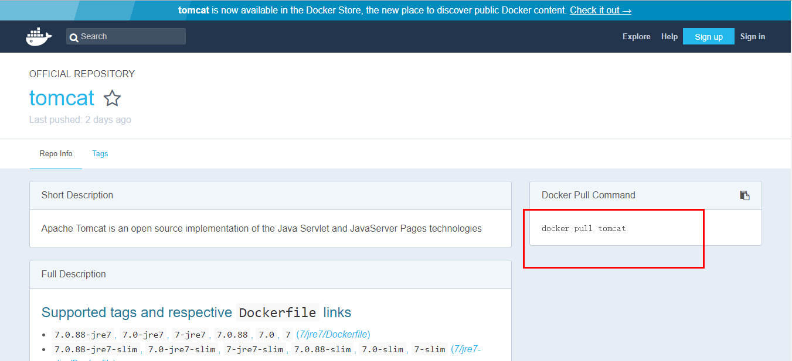
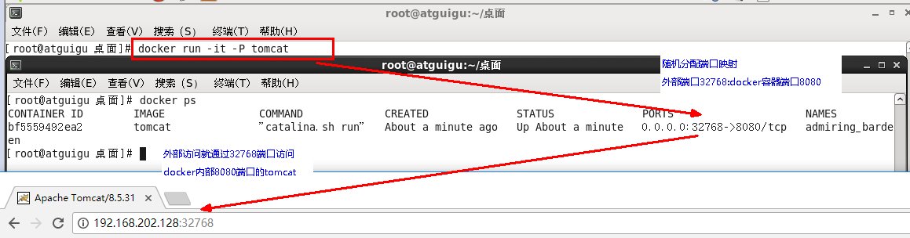
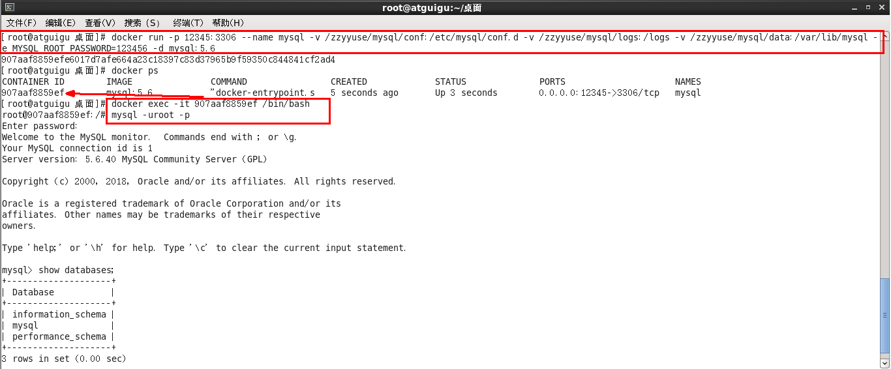
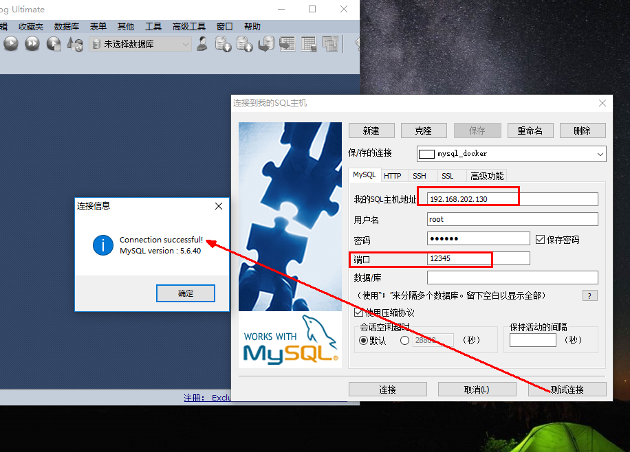
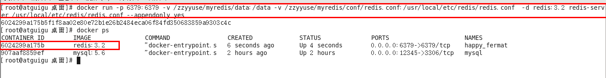
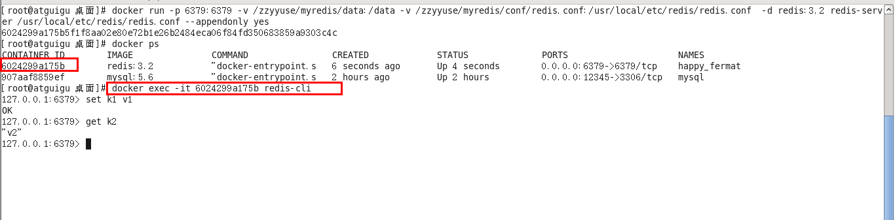
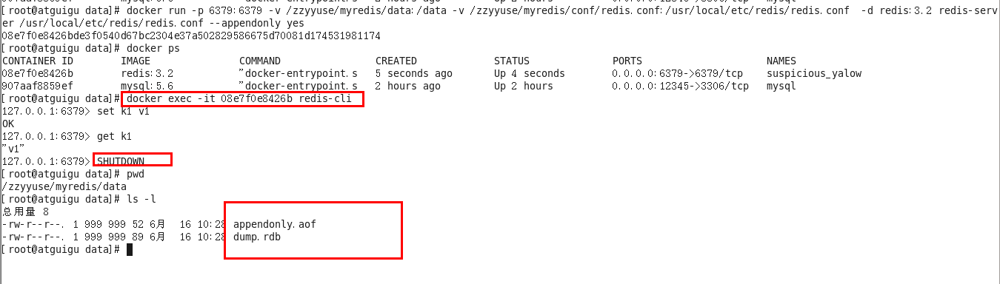

<!--
 * @Filename: 
 * @Description: 
 * @Author: liushuangdan
 * @Date: 2021-03-19 12:06:24
 * @LastEditTime: 2021-03-19 15:31:17
 * @FilePath: \DockerBook\Docker常用安装.md
-->
## Docker常用安装

### 总体步骤
1. 搜索镜像
2. 拉取镜像
3. 查看镜像
4. 启动镜像
5. 停止镜像
6. 移除镜像

### 安装tomcat

- docker hub上面查找tomcat镜像， docker search tomcat 
- 从docker hub上拉取tomcat镜像到本地， docker pull tomcat
  - 官网命令
    
  - 拉取完成
- docker images 查看是否拉取到tomcat
- 使用tomcat镜像创建容器(也叫运行镜像) docker run -it -p 8080:8080 tomcat 
  - -p 主机端口：docker容器端口
  - -P 随机分配端口 
    
  - -i 交互
  - -t 终端 
  
### 安装mysql

- docker hub上面查找mysql 镜像
- 从docker hub上 （阿里云镜像加速器）拉取mysql镜像到本地标签为5.6
- 使用mysql5.6镜像创建容器(也叫运行镜像)
  * 使用mysql镜像
    ```
        docker run -p 12345:3306 --name mysql -v /zzyyuse/mysql/conf:/etc/mysql/conf.d -v /zzyyuse/mysql/logs:/logs -v /zzyyuse/mysql/data:/var/lib/mysql -e MYSQL_ROOT_PASSWORD=123456 -d mysql:5.6
 
        命令说明：
        -p 12345:3306：将主机的12345端口映射到docker容器的3306端口。
        --name mysql：运行服务名字
        -v /zzyyuse/mysql/conf:/etc/mysql/conf.d ：将主机/zzyyuse/mysql录下的conf/my.cnf 挂载到容器的 /etc/mysql/conf.d
        -v /zzyyuse/mysql/logs:/logs：将主机/zzyyuse/mysql目录下的 logs 目录挂载到容器的 /logs。
        -v /zzyyuse/mysql/data:/var/lib/mysql ：将主机/zzyyuse/mysql目录下的data目录挂载到容器的 /var/lib/mysql 
        -e MYSQL_ROOT_PASSWORD=123456：初始化 root 用户的密码。
        -d mysql:5.6 : 后台程序运行mysql5.6
    ```
    `docker exec -it MySQL运行成功后的容器ID     /bin/bash`
    
  * 外部win10也来链接运行在docker上的mysql服务
    
  * 数据备份小测试
  
    `docker exec myql服务容器ID sh -c ' exec mysqldump --all-databases -uroot -p"123456" ' > /zzyyuse/all-databases.sql`


### 安装redis

- 从docker hub上 阿里云加速器拉取redis镜像到本地标签为3.2
- 使用redis 3.2 镜像创建容器 （也叫运行镜像）
  + 使用镜像
    ```
        docker run -p 6379:6379 -v /zzyyuse/myredis/data:/data -v /zzyyuse/myredis/conf/redis.conf:/usr/local/etc/redis/redis.conf  -d redis:3.2 redis-server /usr/local/etc/redis/redis.conf --appendonly yes
    ```
    
  + 在主机/zzyyuse/myredis/conf/redis.conf 目录下新建 redis.conf 文件 vim /zzyyuse/redis/conf/redis.conf/redis.conf
   [redis.conf](redis.txt)
- 测试redis-cli 链接上来
    ` docker exec -it 运行着Rediis服务的容器ID redis-cli`
    
- 测试持久化文件生成
  