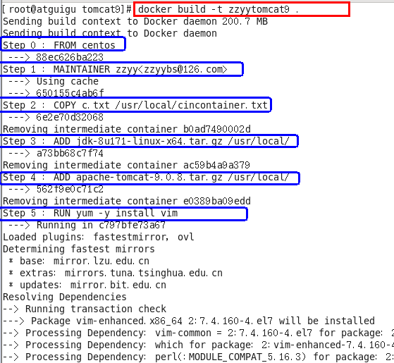
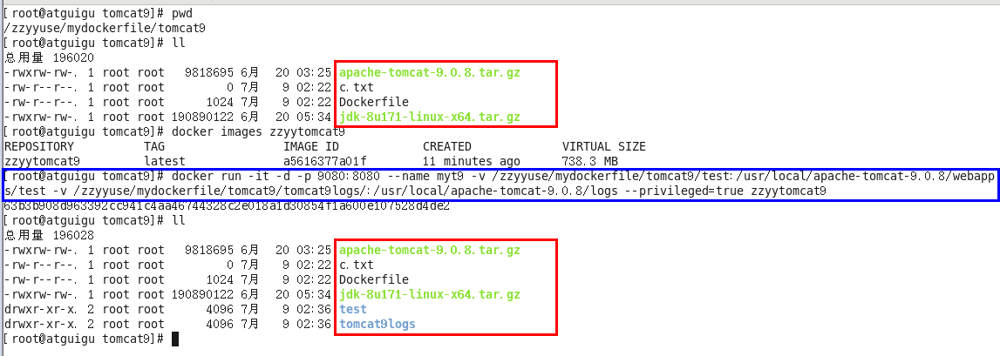
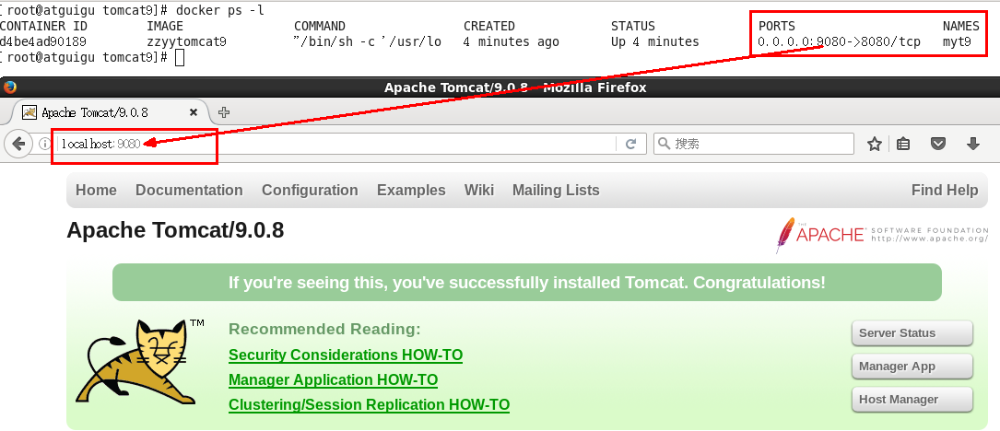

<!--
 * @Filename: 
 * @Description: 
 * @Author: liushuangdan
 * @Date: 2021-02-01 18:07:46
 * @LastEditTime: 2021-03-18 18:22:30
 * @FilePath: \DockerBook\DockerFile解析.md
-->

## DockerFile

### 什么是DockerFile 

 1.  手动编写一个dockerfile文件， 必须符合file 的规范
 2.  有这个文件后， 直接docker build命令执行 获得一个自定义的镜像
 3.  run

类似：
maven build
jar
java -jar ms....

### 定义

 DockerFile 是用来构建Docker镜像的构建文件， 是由一系列命令和参数构成的脚本

### 构建三步骤： 
    - 编写Dockerfile文件
    - docker build
    - docker run
  
### 文件什么样？

以centos为例： https://hub.docker.com/_centos/

-    

-------------

### DockerFile构建过程解析

#### DockerFile内容基础知识

    1. 每条保留字指令都必须为大写字母 并且后面要跟随至少一个参数
    2. 指令按照从上到下 顺序执行
    3. # 表示注释
    4. 每条指令都会创建一个新的镜像层，并对镜像进行提交


#### Docker执行DockerFile的大致流程


- docker从基础镜像运行一个容器
- 执行一条指令并对容器作出修改
- 执行类似docker commit 的操作提交一个新的镜像层
- docker 再基于刚提交的镜像运行一个容器
- 执行dockerfile 中的下一条指令直到所有的指令都执行完成
  

#### 小总结

从应用软件的角度来看， DockerFile、Docker镜像与Docker容器分别代表软件的三个不同阶段

    * Dockerfile 是软件的原材料
    * Docker镜像是软件的交付品
    * Docker容器则可以认为是软件的运行态
  
Dockerfile面向开发， Docker镜像成为交付标准， Docker容器则涉及部署与运维， 三者缺一不可， 合力充当Docker体系的基石。 


1  Dockerfile 需要定义一个Dockerfile， Dockerfile定义了进程需要的一切东西。 Dockerfile涉及的内容包括执行代码或者是文件、环境变量、依赖包、运行时环境、动态链接库、操作系统的发行版、服务进程和内核进程(当应用进程需要和系统服务和内核进程打交道，这时需要考虑吧如何设计namespace的权限控制)等等；

2. Docker镜像， 在用Dockerfile 定义一个文件之后， docker build会产生一个Docker镜像， 当运行Docker镜像时，会真正开始提供服务。 
3. Docker容器， 容器直接提供服务的。 

----

### DockerFile体系结构(保留字指令)

* FROM             基础镜像， 当前新镜像是基于哪个镜像的
* MAINTAINER       镜像维护者的姓名和邮箱地址
* RUN              容器构建时需要运行的命令 
* EXPOSE           当前容器对外暴露出的端口 
* WORKDIR          指定在创建容器后， 终端默认登陆进来的工作目录， 一个落脚点
* ENV              用来在构建镜像过程中设置环境变量
    * ENV MY_PATH /usr/mytest

        这个环境变量可以在后续的任何RUN指令中使用，这就如同在命令前面指定了环境变量前缀一样；

        也可以在其它指令中直接使用这些环境变量，

        比如：WORKDIR $MY_PATH
* ADD              将宿主机目录下的文件拷贝进镜像且ADD命令会自动处理URL和解压tar压缩包
* COPY             类似ADD，拷贝文件和目录到镜像中将从构建上下文目录中<源路径>的文件/目录复制到新的一层的镜像内的<目标路径>位置
* VOLUME           容器数据卷，用于数据保存和持久化工作
* CMD              指定一个容器启动时要运行的命令
    * CMD 指令的格式和 RUN 相似  也是两种格式
      * shell 格式： CMD <命令>
      * exec  格式： CMD ["可执行文件", "参数1", "参数2"...]
      * 参数列表格式： CMD ["参数1", "参数2"...]. 在指定了 ENTRYPOINT 指令后， 用CMD指定具体的参数
    * DockerFile 中可以有多个cmd指令， 但只有最后一个生效， CMD 会被docker run 之后的参数替换
* ENTRYPOINT       指定一个容器启动时要运行的命令
  * ENTRYPOINT 的目的和CMD一样，都是在指定容器启动程序以及参数
* ONBUILD          当构建一个被继承的DockerFile时运行命令， 父镜像在被子继承后父镜像的onbuild被触发     

##### 总结


----

### docker file 案例

#### Base镜像(scratch) 

Docker Hub中99%的镜像都是通过在base镜像中安装和配置需要的软件构建出来的


#### 自定义镜像 centos

1. 编写
   1. Hub默认centos镜像什么情况
      1. 初始centos运行该镜像时默认在/目录下
      2. 默认不支持vim编辑器
      3. 默认不支持ifconfig查看网络配置
   2. 准备编写Dockerfile文件
   3. mycentos内容Dockerfile
      1. FROM centos
      2. MAINTAINER liushuangdan@csm.com.cn
      3. ENV MYPATH /usr/local
      4. WORKDIR $MYPATH
      5. RUN yum -y install vim
      6. RUN yum -y install net-tools
      7. EXPOSE 80
      8. CMD echo $MYPATH
      9. CMD echo "success ---- ok"
      10. CMD /bin/bash
2. 构建
   1. docker build -t 新镜像名字:TAG .
3. 运行
   1. docker run -it 新镜像名字:TAG 
4. 列出镜像的变更历史
   * docker history 镜像名

### CMD/ENTRYPOINT 镜像案例

都是要指定一个容器启动时要运行的命令

CMD
* Dockerfile中可以又多个CMD命令，但是只有最后一个生效，CMD会被docker run 之后的参数替换
* Case tomcat 的讲解演示 docker run -it -p 8888:8080 tomcat ls -l
  
ENTRYPOINT 
* docker run 之后的参数会被当做参数传递给ENTRYPOINT，之后形成新的命令组合
* Case 
  * 制作CMD版可以查询IP信息的容器
    ```
    FROM centos
    RUN yum install -y curl
    CMD [ "curl", "-s", "http://ip.cn" ]
    ```
  * crul 命令解释

        curl命令可以用来执行下载、发送各种HTTP请求，指定HTTP头部等操作。

        如果系统没有curl可以使用yum install curl安装，也可以下载安装。

        curl是将下载文件输出到stdout

        

        使用命令：curl http://www.baidu.com

        执行后，www.baidu.com的html就会显示在屏幕上了

        

        这是最简单的使用方法。用这个命令获得了http://curl.haxx.se指向的页面，同样，如果这里的URL指向的是一个文件或者一幅图都可以直接下载到本地。如果下载的是HTML文档，那么缺省的将只显示文件头部，即HTML文档的header。要全部显示，请加参数 -i
  * 问题 如果我们希望显示HTTP头信息，就需要加上-i参数 

        docker run myip -i 报错
        
        why： 

            我们可以看到可执行文件找不到的报错，executable file not found。

            之前我们说过，跟在镜像名后面的是 command，运行时会替换 CMD 的默认值。

            因此这里的 -i 替换了原来的 CMD，而不是添加在原来的 curl -s http://ip.cn 后面。而 -i 根本不是命令，所以自然找不到。

            那么如果我们希望加入 -i 这参数，我们就必须重新完整的输入这个命令：

            $ docker run myip curl -s http://ip.cn -i

  * 制作ENTRYPOINT 版查询IP信息的容器
    ```
        FROM centos

        RUN yum install -y curl

        ENTRYPOINT [ "curl", "-s", "http://ip.cn" ]
    ```
    


#### 自定义镜像Tomcat

1. mkdir -p /zzyyuse/mydockerfile/tomcat9
2. 在上述目录下touch.txt
3. 将jdk和tomcat安装的压缩包拷贝进上一步目录
   1. apache-tomcat-9.0.8.tar.gz (cp /opt/apache-tomcat-9.0.8.tar.gz .)
   2. jdk-8u171-linux-x64.tar.gz (cp /opt/jdk-8u171-linux-x64.tar.gz .)
4. 在/zzyyuse/mydockerfile/tomcat9目录下新建Dockerfile文件
    ```
    FROM         centos
    MAINTAINER    zzyy<zzyybs@126.com>
    #把宿主机当前上下文的c.txt拷贝到容器/usr/local/路径下
    COPY c.txt /usr/local/cincontainer.txt
    #把java与tomcat添加到容器中
    ADD jdk-8u171-linux-x64.tar.gz /usr/local/
    ADD apache-tomcat-9.0.8.tar.gz /usr/local/
    #安装vim编辑器
    RUN yum -y install vim
    #设置工作访问时候的WORKDIR路径，登录落脚点
    ENV MYPATH /usr/local
    WORKDIR $MYPATH
    #配置java与tomcat环境变量
    ENV JAVA_HOME /usr/local/jdk1.8.0_171
    ENV CLASSPATH $JAVA_HOME/lib/dt.jar:$JAVA_HOME/lib/tools.jar
    ENV CATALINA_HOME /usr/local/apache-tomcat-9.0.8
    ENV CATALINA_BASE /usr/local/apache-tomcat-9.0.8
    ENV PATH $PATH:$JAVA_HOME/bin:$CATALINA_HOME/lib:$CATALINA_HOME/bin
    #容器运行时监听的端口
    EXPOSE  8080
    #启动时运行tomcat
    # ENTRYPOINT ["/usr/local/apache-tomcat-9.0.8/bin/startup.sh" ]
    # CMD ["/usr/local/apache-tomcat-9.0.8/bin/catalina.sh","run"]
    CMD /usr/local/apache-tomcat-9.0.8/bin/startup.sh && tail -F /usr/local/apache-tomcat-9.0.8/bin/logs/catalina.out
    ```
5. 构建docker build -t zzyytomcat9 .
   
6. 构建完成
   
7. run
   ```
        docker run -d -p 9080:8080 --name myt9 -v /zzyyuse/mydockerfile/tomcat9/test:/usr/local/apache-tomcat-9.0.8/webapps/test -v /zzyyuse/mydockerfile/tomcat9/tomcat9logs/:/usr/local/apache-tomcat-9.0.8/logs --privileged=true zzyytomcat9
   ```
   

   报错备注：
   
    Docker挂载主机目录Docker访问出现cannot open directory .: Permission denied

    解决办法：在挂载目录后多加一个--privileged=true参数即可
8. 验证
    
9. 结合前述的容器卷将测试的web服务test发布