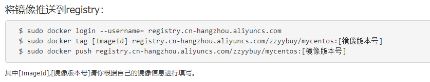

<!--
 * @Filename: 
 * @Description: 
 * @Author: liushuangdan
 * @Date: 2021-03-19 14:12:21
 * @LastEditTime: 2021-03-19 15:32:19
 * @FilePath: \DockerBook\本地镜像发布到阿里云.md
-->
## 本地镜像发布到阿里云

### 本地镜像发布到阿里云流程 


### 镜像的生成方法

1. 前面的dockerfile
2. 从容器创建一个新的镜像
   `docker commit [OPTION] 容器ID [REPOSITORY[:TAG]]`

    ```
    OPTIONS说明：

        -a :提交的镜像作者；

        -m :提交时的说明文字；
    ```
    

### 将本地镜像推送到阿里云

1. 本地镜像素材原型
    
2. 阿里云开发者平台 https://dev.aliyun.com/search.html
3. 创建仓库镜像
   1. 命名空间
   2. 仓库名称
4. 将镜像推送到registry
   1. 
   2. 
5. 公有云可以查询到
   1. 
6. 查看详情
    

### 将阿里云的镜像下载到本地

下载到本地
